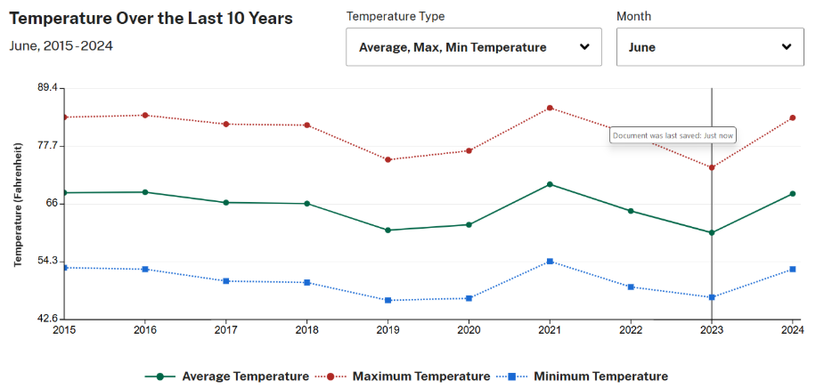
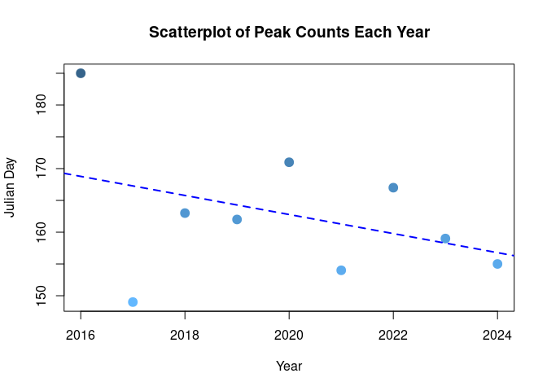

Firefly Abundance - SS
================
Sierra Sinkola
2025-12-02

- [ABSTRACT](#abstract)
- [BACKGROUND](#background)
- [STUDY QUESTION and HYPOTHESIS](#study-question-and-hypothesis)
  - [Questions](#questions)
  - [Hypothesis](#hypothesis)
  - [Prediction](#prediction)
- [METHODS](#methods)
  - [1st Analysis](#1st-analysis)
  - [2nd Analysis](#2nd-analysis)
  - [3rd Analysis](#3rd-analysis)
- [DISCUSSION](#discussion)
  - [Interpretation of 1st analysis (multi bar
    plot)](#interpretation-of-1st-analysis-multi-bar-plot)
  - [Interpretation of 2nd analysis (scatter
    plot)](#interpretation-of-2nd-analysis-scatter-plot)
  - [Interpretation of 3rd analysis (ANOVA and summary
    tests)](#interpretation-of-3rd-analysis-anova-and-summary-tests)
- [CONCLUSION](#conclusion)
- [REFERENCES](#references)

# ABSTRACT

This study uses citizen science data to determine whether peak firefly
abundance is occurring earlier over the years. Based on the data and
figures created, a linear regression analysis was completed to test for
trends in firefly peak sightings. The linear regression test revealed
that there was no significant evidence supporting that firefly peak
abundance is happening earlier each year (p value \> 0.05). The data set
presented limitations related to no standardization of the amount of
entries per year or the method of data collection and recording. Despite
these limitations this research inspires future investigation on the
topic and serves as a basis for future research.

# BACKGROUND

Fireflies are one of the most intriguing insect species, admired for
their mesmerizing bio luminescent display. Fireflies are often an
indicator of the summer season, but the time of their peak abundance may
be changing. As climate change alters temperature patterns across the
region, it is possible that fireflies are emerging and peaking earlier
than in previous years.

Recent temperature data shows a consistent trend of increasing
temperatures in June than in previous years in the state of Utah.
(Dashboard: Detailed Historical Weather for Utah, Utah \| Farmers.Gov,
n.d.). Previous research has found that climate conditions have a small,
yet significant effect on firefly abundance (Evans et al., 2019).
Building on this idea, our study investigates firefly peak abundance has
changed in timing at all due to the pattern of rising temperatures in
Utah.

We will be using data from a publicly available citizen data set in Utah
to further explore this question. These firefly observations alongside
temperature trend data across the past several years will allow us to
determine whether fireflies are peaking due to climate related
environmental changes.



# STUDY QUESTION and HYPOTHESIS

## Questions

Is firefly peak abundance occurring sooner than in years previous?

## Hypothesis

Firefly population sightings are greater earlier in the year than in
prior years.

## Prediction

If the hypothesis is not rejected, then firefly abundance will peak
earlier in June when compared to observational data from previous years
from summer months.

# METHODS

To determine whether peak firefly population sightings occurring earlier
as years go on, we analyzed Utah citizen science observational data
provided by Christy Bills (Bills, C., 2025) and was accessed through the
Natural History Museum of Utah (2025). Using data from citizens across
Utah allows us to have a greater understanding of the firefly
populations on a more broad scope than if we were to conduct this
research ourselves in a limited area. However, the data set we used did
have limitations due to the accuracy of evidence. Therefore, we decided
to use a metric of instances (the presence of a firefly sighting)
instead of firefly counts, which are more difficult to track and record
accurately. To further simplify the data, we also used the metric of
Julian days, rather than by month and day. This give us a more
understandable time metric of when these instances had occurred.

We ran three different analyses on the data. The first analysis was
focused on analyzing the number of instances in the seasons of each year
2016 through 2024. Each season was correlated with a month for easy
visualization and for greater relevance to the research question. The
second analysis displayed the day of each year of interest in which peak
firefly sightings were made. This allowed us to see day exact day of
year if the firefly peak sightings were occurring earlier, the trend
line was especially helpful for this. The final analysis was an ANOVA
and summary test on the data. This allowed us to test for statistical
significance and data correlation. Overall, these analyses helped us
conclude how firefly abundance has changed over time.

## 1st Analysis

Multi bar plot showing firefly abundance for months of the year from
2016-2024.

``` r
data <- read.csv("UtahFireflies - Revised.csv")

ggplot(data, aes(x= Month))+
  geom_bar(fill = "yellow3") +
  facet_grid(~ Year) +
  labs(title = "Number of Instances by Month and Year", 
       x = "Month", 
       y = "Number of Instances") +
  theme_minimal()
```

<!-- -->

We compared the number of instances (observations of fireflies)
throughout the year. The numbers correspond to months of the year. This
bar blot presenting data across 8 years helps us visualize peak firefly
counts for each year. Independent years allow us to see that June is the
peak month for firefly observations while data from each year on the
same graph helps us easily visualize abundance trends throughout the
past 8 years.

## 2nd Analysis

Scatter Plot showing earlier peak in firefly abundance over the years.

``` r
# plot each year's Julian day max
table_Julian <- table(data$Year, data$Julian)
# find the max count for each year
max_col <- apply(table_Julian, 1, which.max)
# create a data frame with year and max Julian day
Julian <- as.numeric(colnames(table_Julian)[max_col])
Year <- c(2016, 2017, 2018, 2019, 2020, 2021, 2022, 2023, 2024)
# create a color gradient
color_gradient <- colorRampPalette(c("steelblue1", "steelblue4"))
# Generate a vector (color gradient) based on Julian values
cols <- color_gradient(100)[as.numeric(cut(Julian, breaks = 100))]
#plot as scatter plot
plot(Year, Julian, main = "Scatterplot of Peak Counts Each Year",
     col = cols,
     pch = 19,       # filled circles
     cex = 1.5,      # point size
     ylab = "Julian Day")
# add a linear regression trendline
abline(lm(Julian ~ Year), col = "blue", lwd = 2, lty = 2)
```

<!-- -->

We plotted the day of each year (Julian day) in which firefly
observations indicated peak abundance from 2016 to 2024. The lower the
Julian day’s value, the earlier it represents in the year. The trend
line indicates that there has been a gradual shift towards firefly
abundance peaking earlier in the year over the past 8 years. The slope
of the trend line is -1.5, as indicated in the 3rd analysis. This
scatter plot is helpful to clearly visualize when exactly firefly counts
have peaked each year from 2016 to 2024. The trend line provides clarity
of the pattern that is revealed by the data.

## 3rd Analysis

ANOVA Test

``` r
#create data frame 
Julian_dataframe <- data.frame(ColumnA = Julian, ColumnB = Year)
m1 <- lm( ColumnA ~ ColumnB, data=Julian_dataframe)
# ANOVA test to test for significance
anova(m1)
```

    ## Analysis of Variance Table
    ## 
    ## Response: ColumnA
    ##           Df Sum Sq Mean Sq F value Pr(>F)
    ## ColumnB    1 135.00  135.00  1.2014 0.3093
    ## Residuals  7 786.56  112.36

``` r
summary(m1)
```

    ## 
    ## Call:
    ## lm(formula = ColumnA ~ ColumnB, data = Julian_dataframe)
    ## 
    ## Residuals:
    ##     Min      1Q  Median      3Q     Max 
    ## -18.278  -2.778  -1.778   7.222  16.222 
    ## 
    ## Coefficients:
    ##             Estimate Std. Error t value Pr(>|t|)
    ## (Intercept) 3192.778   2764.342   1.155    0.286
    ## ColumnB       -1.500      1.368  -1.096    0.309
    ## 
    ## Residual standard error: 10.6 on 7 degrees of freedom
    ## Multiple R-squared:  0.1465, Adjusted R-squared:  0.02456 
    ## F-statistic: 1.201 on 1 and 7 DF,  p-value: 0.3093

These statistical tests allow for evaluation of significance of the
data. The ANOVA F value (1.2014) is a measure of how much of the
variance from ColumnA can be explained by ColumnB in comparison to
unexplained variance. The found p value of 0.3093 is above the threshold
of 0.05, indicating the data is not statistically significant. The
residuals summary tells us that there is moderate variability as the
spread is from -18.278 to 16.222. This is how far the points are from
the regression line. And finally, the coefficients table tells us the
slope for the regression line is -1.5 (each unit increase in ColumnB
indicates a 1.5 unit decrease in ColumnA). (Copilot, personal
communication, November 22, 2025)

# DISCUSSION

From the data set, it is not evident that there is a clear trend of
firefly peak sightings occurring earlier over the years. The regression
analysis calculated a p value that is above the standard threshold of
0.05, indicating no statistical significance. Our study does have some
limitations, however. Despite cleaning up the citizen observations for
our data set, there are likely still some inaccuracies due to
inconsistent reporting methods. Additionally, uneven data entries across
the years could skew the data, introducing bias. This could be making
one year’s data appear more reliable and significant than another’s due
to larger sample sizes.

Future studies would benefit from standardized entries, data collection
protocols, and more observations. This would allow for reliable,
consistent, and unbiased data.

## Interpretation of 1st analysis (multi bar plot)

The multi bar plot indicates the number of instances (the occurrence of
a firefly sighting) per year ranging from 2016 to 2024. Each year has
subdivided data which indicated four months of the year, correlating to
the seasons. Month 3 is March (spring), month 6 indicates June (summer),
month 9 is September (fall), and month 12 is December (winter). This
detailed graph allowed us to interpret which month/season saw the most
fireflies per year and helped us to easily compare sightings across the
year to aid in answering the research question. Looking at the graph, it
is clear that June is the peak month for firefly instances, while data
for the other months is not consistent over the years.

## Interpretation of 2nd analysis (scatter plot)

The scatter plot indicates the exact day (Julian day) based on the data
set that firefly sightings peaked. This is shown from each year 2016 to
2024. It can be seen that 2016 had a very late peak firefly sighting
occurrence in comparison to the other years considered. This is likely
an outlier as each other data point appears much closer to the others
plotted. The regression trend line shows a slight shift towards earlier
peak firefly abundance as the years go on.

## Interpretation of 3rd analysis (ANOVA and summary tests)

The third analysis takes the data plotted in the two previous analyses
and tests the statistical significance of them. From the ANOVA test and
summary, it was determined that the data was not statistically
significant. This is evident from the p value of 0.3093, which is
significantly higher than the determined threshold of significance (p \<
0.05). The ANOVA F value (1.2014) explains whether including the year
significantly improves an accurate prediction of Julian day. Our F value
tells us that ColumnB cannot be effectively used to predict ColumnA. We
also ran a residuals summary, which tells us that there is moderate
variability as the spread is from -18.278 to 16.222. This indicates how
far the points on the scatter plot are from the regression line. Lastly,
our analysis on the coefficients table indicates the slope for the
regression line as -1.5 (each unit increase in ColumnB indicates a 1.5
unit decrease in ColumnA). However, because of the p value, this is not
statistically significant.The adjusted R-squared value supports this
conclusion of no significance with a value of 0.025.

# CONCLUSION

In conclusion, the question of is firefly peak abundance occurring
sooner than in years previous can be answered through the analyses we
have ran. It was predicted that if the hypothesis is not rejected, then
firefly abundance will peak earlier in June when compared to
observational data from previous years from summer months. However, it
can be concluded that firefly abundance is not peaking earlier over the
years. The data does not show statistical significance, indicated by the
large p value. Further research must be done to understand environmental
influences on firefly behavior. Possible areas to explore are the
effects of temperature, precipitation, and light intensity (pollution)
on the timing of yearly peak firefly abundance.

# REFERENCES

1.  Bills, C. (2025, September 25). Citizen Science. Utah State
    University.

2.  Evans, T. R., Salvatore, D., van de Pol, M., & Musters, C. j. m.
    (2019). Adult firefly abundance is linked to weather during the
    larval stage in the previous year. Ecological Entomology, 44(2),
    265–273. <https://doi.org/10.1111/een.12702>

3.  OpenAI. (2025, October 30). Barplot creation in R \[Generative AI
    chat\]. ChatGPT.

4.  Dashboard: Detailed Historical Weather for Utah, Utah \|
    Farmers.gov. (n.d.). Retrieved December 2, 2025, from
    <https://www.farmers.gov/dashboard/utah/utah/historical-weather?hc_temp_chart=%7B%22temp_type%22%3A%22all%22%2C%22month%22%3A%225%22%7D>

5.Microsoft. (2025). Copilot \[Large language model\]. Microsoft.
<https://copilot.microsoft.com>

6.  Western Firefly Project: A Community Science Initiative \| Natural
    History Museum of Utah. (2025, October 18).
    <https://nhmu.utah.edu/citizen-science/fireflies>
